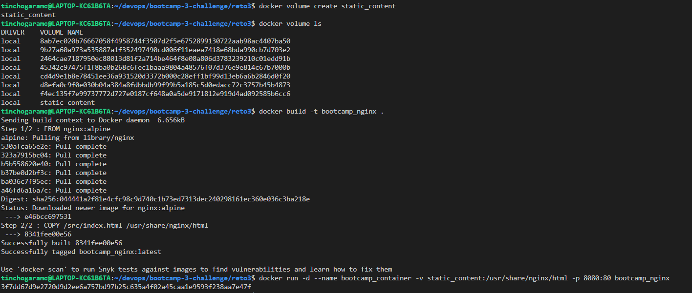

# Clase 4 - Docker

### Ejercicio 3

#### Crea un contenedor con las siguientes especificaciones:

#### Acceder a la URL http://localhost/8080/index.html y comprobar que aparece la pagina deseada

### Deploy to Registry DockerHub
[DockerHub:tinchogaramo/bootcamp_nginx](https://hub.docker.com/repository/docker/tinchogaramo/bootcamp_nginx)