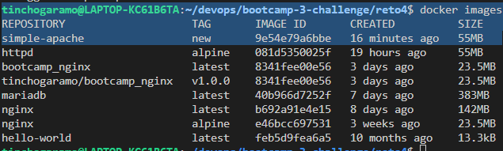

# Clase 4 - Docker

### Reto 4

#### Ejercicio 1 - Crear imagen de Apache


#### Ejercicio 2 - Crear contenedor desde la nueva imagen
```
tinchogaramo@LAPTOP-KC61B6TA:~/devops/bootcamp-3-challenge/reto4$ docker run -d -p 5050:80 --name my_apache simple-apache:new 
0c2e0c93f74d44aa8f65c3ab03769dba2ab6d50d91c7ac67acde726390d1078e
tinchogaramo@LAPTOP-KC61B6TA:~/devops/bootcamp-3-challenge/reto4$ docker ps
CONTAINER ID   IMAGE               COMMAND              CREATED         STATUS         PORTS                                   NAMES
0c2e0c93f74d   simple-apache:new   "httpd-foreground"   8 seconds ago   Up 5 seconds   0.0.0.0:5050->80/tcp, :::5050->80/tcp   my_apache
```


### Ejercicio 3 - Inspeccionar la imagen

Image contains 21 layers (22 - headers)
tinchogaramo@LAPTOP-KC61B6TA:~/devops/bootcamp-3-challenge/reto4$ docker image history simple-apache:new | wc
     22     235    2097
