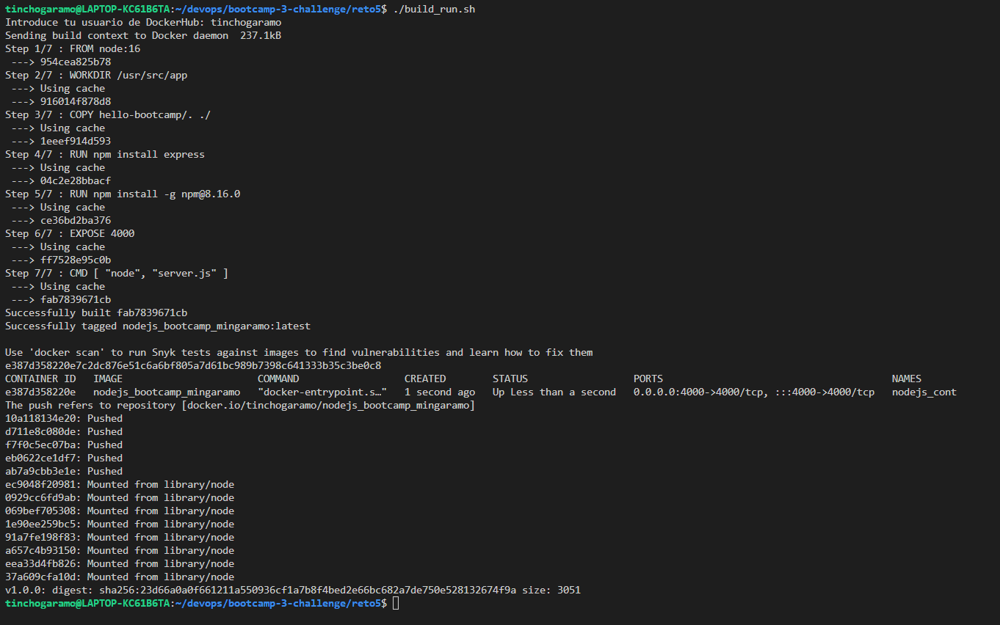
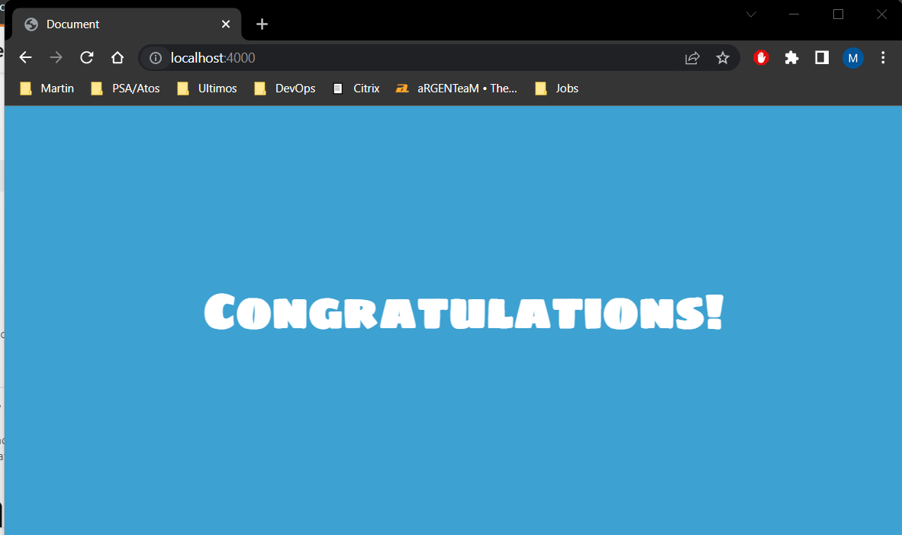
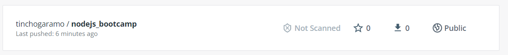

# Clase 4 - Docker

### Reto 5

#### Build & Run de la imagen nodejs

#### Abriendo la aplicación en un browser

#### Prueba Build/Run/Registry a traves de script build_run.sh

#### Imagen subida a DockerHub
